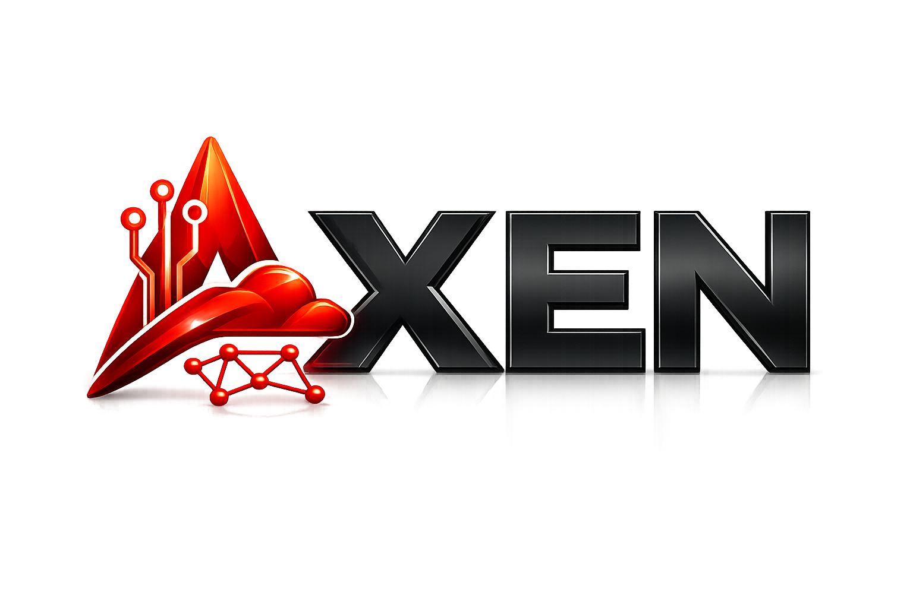

# AXEN — Infrastructure, Cloud & Automation



**AXEN** es una empresa especializada en infraestructura IT, cloud, automatización e inteligencia artificial. Este repositorio contiene la landing page corporativa y el panel de administración CMS.

---

## 📁 Estructura del proyecto

```
AXEN/
├── index.html                  # Landing page principal
├── assets/
│   ├── css/style.css           # Estilos (3 temas: Default, Navy & Gold, Slate & Emerald)
│   ├── js/main.js              # JavaScript (AOS, Swiper, theme switcher, SVG lines)
│   └── img/
│       ├── logo/               # Logos AXEN (PNG + SVG)
│       └── tech/               # Logos de tecnologías (AWS, Docker, K8s, etc.)
├── admin/
│   ├── app.py                  # Panel CMS (Flask + SQLAlchemy)
│   ├── requirements.txt        # Dependencias Python
│   ├── templates/              # Templates Jinja2 del admin
│   ├── static/uploads/         # Archivos subidos desde el CMS
│   └── instance/               # Base de datos SQLite (no versionada)
├── .gitignore
└── README.md
```

## 🚀 Inicio rápido

### Landing page
Servir con cualquier servidor estático:
```bash
# Python
cd AXEN && python -m http.server 8080

# Node.js
npx serve .
```
Abrir → `http://localhost:8080`

### Panel de administración
```bash
cd admin
pip install -r requirements.txt
python app.py
```
Abrir → `http://localhost:5000`

**Credenciales por defecto:** `admin` / `admin123`

## 🎨 Temas de color

La landing incluye 3 temas seleccionables desde la navbar:

| Tema | Primario | Acento |
|------|----------|--------|
| **Default** | `#FFFFFF` | `#C8102E` |
| **Navy & Gold** | `#0A1220` | `#D4A855` |
| **Slate & Emerald** | `#111827` | `#10B981` |

## 🛠 Stack tecnológico

- **Frontend:** HTML5, CSS3 (custom properties), Vanilla JS
- **Animaciones:** AOS.js, Swiper.js
- **Backend CMS:** Flask, SQLAlchemy, Flask-Login
- **Base de datos:** SQLite
- **Iconos:** Font Awesome 6.5

## 📄 Licencia

© 2026 AXEN. Todos los derechos reservados.
